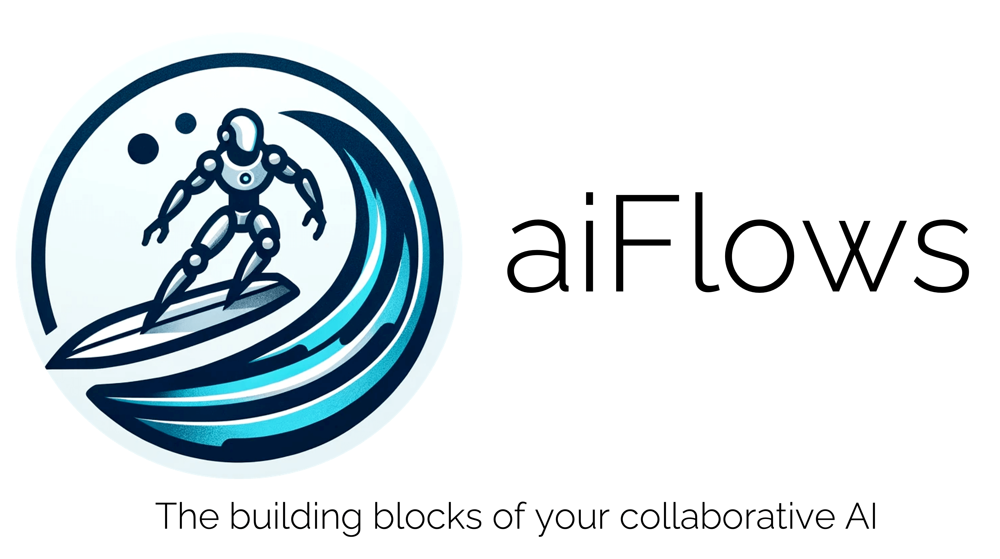
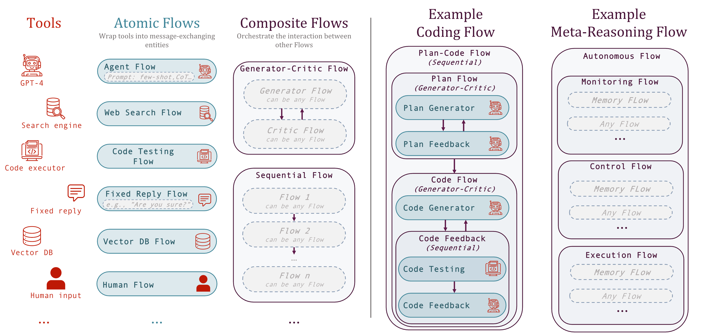

<p align="center">
      <br/>
            
      <br/>
<p>

<p align="center">
    <a href="https://epfl-dlab.github.io/flows">
    
    </a>
    <a href="https://discord.gg/yFZkpD2HAh">
    
    </a>
    <a href="https://epfl-dlab.github.io/flows/docs/built_with_sphinx/html/index.html">
    
    </a>
    <a href="https://www.python.org/downloads/release/python-3100/"></a>
    <a href="https://arxiv.org/abs/2308.01285">
    
    </a>
</p>

🤖🌊 **aiFlows** embodies the <a href="docs/flows_paper.pdf">*Flows*</a> abstraction (<a href="https://arxiv.org/abs/2308.01285">arXiv</a>) and greatly simplifies the design and implementation of complex (work)Flows involving humans, AI systems, and tools. It enables:

- 🧩 Modularity: Flows can be stacked like lego-blocks into arbitrarily nested structures with the complexity hidden behind a message-based interface
- 🤝 Reusability: Flows can be shared publicly on the FlowVerse, readily downloaded and reused as part of different Flows
- 🔀 Concurrency: Being consistent with the Actor model of concurrent computation, Flows are concurrency friendly – a necessary feature for a multi-agent future

## Flows in a Nutshell

The framework is centered around *Flows* and *messages*.
Flows represent the fundamental building block of computation. They are independent, self-contained, goal-driven entities able to complete a semantically meaningful unit of work.
To exchange information, Flows communicate via a standardized message-based interface. Messages can be of any type the recipient Flow can process.
<p align="center">
      
      <p align="justify">
      <strong>The <em>Flows</em> framework exmplified.</strong> The first column depicts examples of tools. Notably, in the Flows framework, AI systems correspond to tools. The second column depicts Atomic Flows, effectively minimal wrappers around tools, constructed from the example tools. The third column depicts examples of Composite Flows defining structured interaction between Atomic or Composite Flows. The fourth column illustrates a specific Composite competitive coding Flow as those used in the experiments in the <a href="https://arxiv.org/abs/2308.01285">paper</a>. The fifth column outlines the structure of a hypothetical Flow, defining a meta-reasoning process that could support autonomous behavior.
      </p>
<p>

## FlowVerse in a Nutshell
The FlowVerse is a repository of Flows (powered by the 🤗 HuggingFace hub) created and shared by our community for everyone to use! With aiFlows, these Flows can be readily downloaded, used, extended or composed into novel, more complex Flows. For the ones using ChatGPT, you could think of them as open-source GPTs(++).

## Why should I use aiFlows?
AI is set to revolutionize the way we work. Our mission is to support AI researchers and to allow them to seamlessly share advancements with practitioners. This will establish a feedback loop, guiding progress toward beneficial directions while ensuring that everyone can freely access and benefit from the next-generation AI tools.

#### As a researcher, you will benefit from the:
- ability to design, implement, and study arbitrarily complex interactions
- complete control and customizability (e.g., the tools, the specific Flows and the information they have access to, the choice of models and their deployment, etc.)
- ability to readily reproduce, reuse, or build on top of Flows shared on the FlowVerse and systematically study them across different settings (the infrastructure in the <a href="https://github.com/epfl-dlab/cc_flows">cc_flows</a> repository could be a useful starting point in future studies)
- ability to readily make your work accessible to practitioners and other researchers and access their feedback.

#### As a practitioner, you will benefit from the:
- ability to design and implement arbitrarily complex interactions
- complete control and customizability (e.g., the tools, the specific Flows and the information they have access to, the choice of models and their deployment, etc.)
- ability to readily reuse or build on top of Flows shared on the FlowVerse
- direct access to any advancements in the field.

To develop the next-generation AI tools and at the same time maximally benefit from them, developers and researchers need to have complete control over their workflows -- aiFlows strives to empower you to make each Flow your own!

Furthermore, we strongly believe that the proof of the pudding is in the eating, and the best way to identify promising directions as well as important missing features is by experimenting. Therefore, we invite researchers and developers alike to be creative and start developing Flows that will push the library to its breaking point. We encourage you to try to develop your idea in public; you are likely to find others interested in your project, benefit from the hivemind, and progress faster.
We will try to support you in any way possible, but also lead by example, working toward JARVIS -- your fully customizable open-source version of ChatGPT+(++)! This is just the beginning, and we have a long way to go. Let's work on a great future [together](#contribute)!

(ToDo: Verify that the link above works)

## Installation
(ToDo: Do we need any other information?)

The library requires Python 3.10+. To install the library, run the following command:

```shell
pip install aiflows
```

<details>
  <summary>Other installation options</summary>

### Install bleeding-edge (ToDo: is this the easiest way to do it?)

```shell
git clone git@github.com:epfl-dlab/aiflows.git
cd aiflows
pip install -e .
```
</details>


## Getting Started

### [Quick start (5 min)](docs/Quick_Start/quick_start.md)

Here you'll see how you can run inference with your first question answering Flow, and you can trivially change between vastly different question answering Flows thanks to the modular abstraction and FlowVerse!

### [Tutorial (20 min)](docs/Tutorials/tutorial_landing_page.md)

In this tutorial, we introduce you to the library's features through a walkthrough of how to build useful Flows of gradually increasing complexity. Starting from a vanilla QA Flow, we'll first extendind it to a ReAct Flow, then ReAct with human feedback, and finish the tutorial with a version of AutoGPT!

### <a href="ToDoAddLink">Developer's Guide (10 min)</a>

We are constantly optimizing our Flow development workflow (pun intended:). In this short guide, we share our best tips, so that you don't have to learn the hard way.

### <a href="ToDoAddLink">Detailed Examples</a>

Many of the recently proposed prompting and collaboration strategies involving tools, humans and AI model are in essence specific Flows (see the figure below). In the link above, you'll find a detailed walkthrough of how to build some representative workflows.

ToDo: Add Figure with all methods from appendix with rounded corners.

## Contribution
There are two ways to contribute to the project: by contributing to the aiFlows codebase or by contributing to the Flow-verse.

- **aiFlows Codebase**: We welcome contributions to the project and accept pull requests of all sorts: documentation, code, bug fixes, etc.

- **FlowVerse**: We hope to establish flows as a platform to enable collaboration, sharing and reusing. Uploading your work to the Flow-verse is a great way to contribute to the community and to the project.

Last but not least, if you want to prepare educational material (tutorials, videos, etc.) about flows, we would love to hear from you! We are happy to link to your content from the project website.

All Github contributors will be explicitly named in release notes of future versions of the library. If anything is unclear, confusing, or needs to be refactored, please let us know by opening an issue on the repository.

### To delve into the world of contribution, explore our <a href="ToDoAddLink">Contribution Guide</a> !

This comprehensive resource is designed to equip you with valuable insights on various aspects, including:

- Connecting with Like-Minded Contributors & How to Get Help
- aiFlows Contribution Guides (for aiFlows' codebase and the FlowVerse)
- Automating The Generation Of FlowCards (READMEs) for the FlowVerse
- Coding Standards for aiFlows
- Contributors Wall and Sharing/Publicizing Your aiFlows Project or Flow
- Licence Information (spoiler alert: it’s open-source and completely free!)

(ToDo: Include a link to the roadmap. How do we showcase it? Encourage people to pick up items not on our list. Encourage people who have ambitious projects to consider building them on top of Flows and would like support/coordination to reach out.  Encourage ppl who build infrastructural goals that are related, aligned, or can complement each other to reach out to us so that we can coordinate.)

A non-comprehensive list of items to include in the roadmap:
- JARVIS
- conditionals
- FlowViz
- Concurrency beyond data parallelism
- Further simplification of the developer experience (feedback required!)
- FlowsStudio


## Citation

To reference the 🤖🌊 **aiFlows** library, please cite the paper [Flows: Building Blocks of Reasoning and Collaborating AI](https://arxiv.org/pdf/2308.01285.pdf):

```
@misc{josifoski2023flows,
      title={Flows: Building Blocks of Reasoning and Collaborating AI},
      author={Martin Josifoski and Lars Klein and Maxime Peyrard and Yifei Li and Saibo Geng and Julian Paul Schnitzler and Yuxing Yao and Jiheng Wei and Debjit Paul and Robert West},
      year={2023},
      eprint={2308.01285},
      archivePrefix={arXiv},
      primaryClass={cs.AI}
}
```

# ToDO

- Update the time estimates in the Demos and Tutorials
- Make sure that the library is published as aiflows on pip (check if `flows` is hardcoded somewhere in the context of the loggers)

<hr>
Q: Should we have a dedicated list of the features? Which features would we include? Where would we keep the list?

<hr>
Q: Should we have a list of existing / useful Flows (otherwise how do we highlight the useful Flows e.g., HumanInput, ChatFlow etc.)? Maybe suggest that everyone should share his Flow in a discussion page on Discord or sth like that? Would that support searching? What about voting?

<hr>
Q: Can one install the library with conda? Should we support that?
