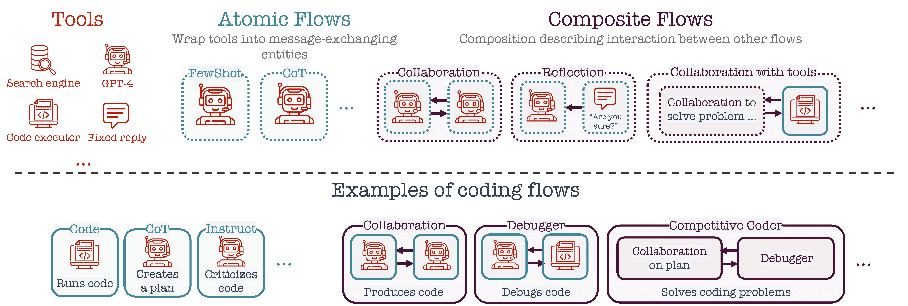

=====================================
General Idea
=====================================

Recent advancements in AI have produced highly capable and controllable agents. This creates unprecedented opportunities for structured reasoning,collaborations among multiple agents, and interactions between agents and tools. 

To fully realize this potential, it is essential to develop principled ways of thinking about structured interactions involving reasoning agents.This paper makes such systematic thinking possible by introducing the conceptual framework of flows. 

This paper introduces the conceptual framework of Flows: a systematic approach to modeling such complex interactions. Flows are modular building blocks that can be combined and composed into interactions of arbitrary complexity in an open-ended way. 

For example, prompting schemes, agent--agent, agent--tools, and even agent--human interactions are special instances of flows that can be composed into more complex flows.

To support rigorous and reproducible research on flows, we have developed the library, which comes with a repository of essential flows. The library enables researchers to specify, implement, and evaluate any flow of interest, and we invite others to contribute to the repository by assembling complex flows from the existing ones.

To demonstrate the potential of our library, we implement complex flows for the challenging task of competitive programming — a task on which even gpt struggles. Our results show that flows combining structured reasoning and collaboration significantly improve problem-solving capabilities. Interestingly, our evaluation reveals significant performance drops for OpenAI chatbots for problems released after their pre-training phase.

Overall, the flows framework offers a language to model and study complex AI agent systems, while our library makes it easy to implement and evaluate them in practice.

