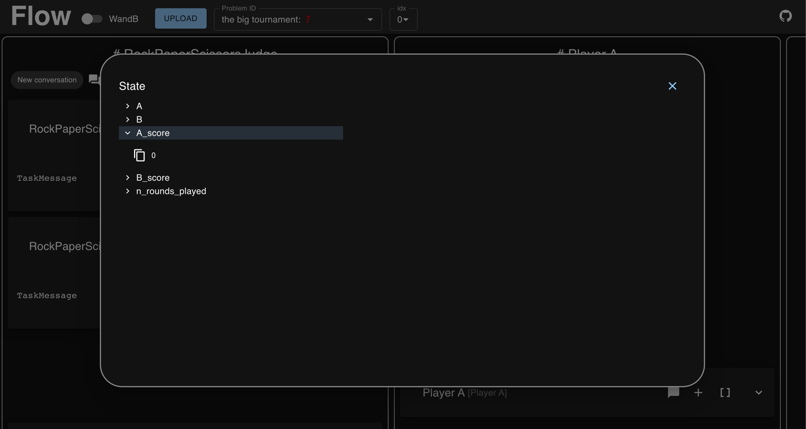

.. _visualization_toolkit:

=============================
Use the Visualization Toolkit
=============================

To help you debug your ``Flow`` implementations, we provide a visualization toolkit.
This tutorial is optional, you can use the flows library without it.

To install the tool you need ``NodeJS`` and ``npm``. Then you can install it with::

  git clone git@github.com:epfl-dlab/flows_visualization.git
  cd flows_visualization
  cd frontend
  npm install

Visualize the RockPaperScissors game
------------------------------------

Let's continue with the RockPaperScissors game.
We need to write the ``OutputMessage`` to disk, so that the visualization tool can read it ::

    if __name__ == "__main__":
        judge = RockPaperScissorsJudge(flow_config = {"name":"RockPaperScissorsJudge", "description":"RockPaperScissorsJudge"})
        task = judge.package_task_message(judge, "run", {}, expected_outputs=["A_score", "B_score"])
        output = judge(task)

        # the visualization tool requires the following output structure:
        # if you have different configurations, group them by id
        # inference_outputs is a list, to allow for multiple samples of a flow run
        data = [{"id": "the big tournament", "inference_outputs": [output]}]
        write_outputs("./temp.jsonl", data, "w")

Now you can start the tool::

  cd flows_visualization
  cd frontend
  npm start

and open your browser at ``http://localhost:3000``.

Upload the ``temp.jsonl`` file you'll be able to see the messages that were sent and received.
The visualization tool allows you to investigate the state of the ``Flow``, the metadata of messages.

Stay tuned
----------

We're actively using the visualization tool in our research and can highly recommend it.
Several improvements to the tool are on the way. So stay tuned!
