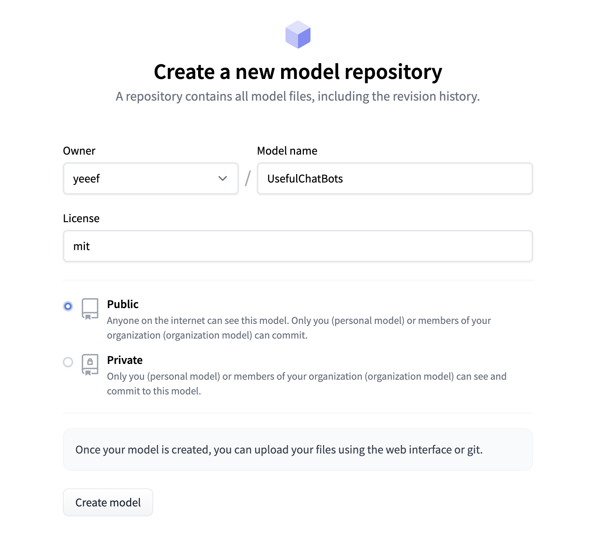
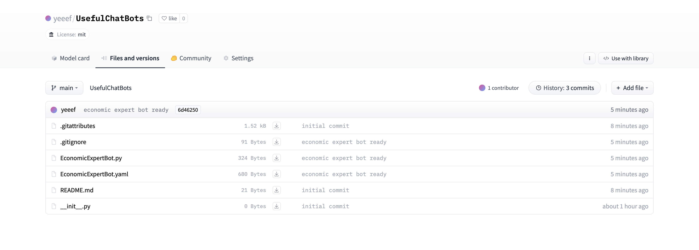

.. _publish_module:

======================================================
Create, Test, and Publish Your Own Flow Module
======================================================

In this tutorial, we will guide you on *Creating, Testing, and Publishing* your own flow module.

Create your own flow module
=============================

To start, create a local directory where you'll develop your flow module:

.. code-block:: shell

    (flows) ➜  dev-tutorial mkdir PATH_TO_LOCAL_DEV_DIRECTORY/dev_UsefulChatBots
    (flows) ➜  dev-tutorial cd PATH_TO_LOCAL_DEV_DIRECTORY/dev_UsefulChatBots
    (flows) ➜  dev_UsefulChatBots touch __init__.py
    (flows) ➜  dev_UsefulChatBots touch .gitignore 
    (flows) ➜  dev_UsefulChatBots touch EconomicExpertBot.py
    (flows) ➜  dev_UsefulChatBots git init     
    (flows) ➜  dev_UsefulChatBots git:(main) ✗ git add .
    (flows) ➜  dev_UsefulChatBots git:(main) ✗ git commit -m "initial commit"                        
    [main (root-commit) e592fd1] initial commit
    3 files changed, 0 insertions(+), 0 deletions(-)
    create mode 100644 .gitignore
    create mode 100644 EconomicExpertBot.py
    create mode 100644 __init__.py

Next, we could either develop from scratch as in :ref:`write_atomic` or we could leverage an existing flow module and build upon it. In this tutorial, we'll develop our chatbot based on `saibo/ChatFlows <https://huggingface.co/saibo/ChatFlows>`__ thanks to the modularity of Flows:

.. code-block:: python
    
    dependencies = [
    {"url": "saibo/ChatFlows", "revision": "main"},
    ]
    from flows import flow_verse
    flow_verse.sync_dependencies(dependencies) 

    from flow_modules.saibo.ChatFlows import ChatGPT4

    class EconomicExpertBot(ChatGPT4):
    def __init__(self, **kwargs):
        super().__init__(**kwargs)

We recommend to associate your flow with a default yaml file as the default config. This default config will serve as a clear spec of the Flow class. For example, in our case:

.. code-block:: yaml

  name: "EconomicExpertBot"
  verbose: False
  description: "A chatbot which answers questions about the economy."

  input_keys: 
    - "query"

  output_keys:
    - "response"

  system_message_prompt_template:
    _target_: langchain.PromptTemplate
    template: |2-
      You are an expertise in finance, economy and investment. When you explain something, you always provide associated statistical numbers, source of the information and concrete examples. You tend to explain things in a step-by-step fashion to help the reader to understand. You are also proficient in both English and Chinese. You can answer questions fluently in both languages.

    input_variables: []
    template_format: jinja2

This explicitly informs potential users about the ``input_keys`` and ``output_keys``, which can be seen as the interface of our Flow. Since we're inheriting from ``saibo/ChatFlows.ChatGPT4``, we also inherit the `default config <https://huggingface.co/saibo/ChatFlows/blob/main/ChatGPT4.yaml>`__ from it. Therefore, our default config can be succinct and only needs to tweak some essential parameters.

Note that a flow module should ideally be a self-contained python module. Therefore, it's best to use relative import inside your code such that other users can use your flow instantly.

Test your own flow module
============================

So far so good, we have created our own flow. Let's now try to test it:

.. code-block:: python

    dependencies = [
        {"url": "yeeef/UsefulChatBots", "revision": "PATH_TO_LOCAL_DEV_DIRECTORY/dev_UsefulChatBots"},
    ]
    from flows import flow_verse
    flow_verse.sync_dependencies(dependencies) 

    import os

    from flow_modules.yeeef.UsefulChatBots.EconomicExpertBot import EconomicExpertBot
    from flows.flow_launchers import FlowLauncher

    if __name__ == "__main__":
        openai_key = os.environ.get("OPENAI_API_KEY")
        bot = EconomicExpertBot.instantiate_from_default_config(overrides={"verbose": False, "api_key": openai_key})
        # the data points in inputs must satisfy the requirements of input_keys
        inputs = [
            {
                "id": 0, "query": "What is CPI? What is the current CPI in the US?",
            },
        ]
        print(f"inputs: {inputs}")

        # init a minimal flow_launcher without specifying the output_keys, then 
        # the full output_keys will be given
        outputs = FlowLauncher.launch(
            flow=bot,
            data=inputs,
            api_keys={"openai": os.getenv("OPENAI_API_KEY")},
        )
        print(outputs)

As we are developing locally, the remote revision does not exist yet, so we point the revision to the local path we just created: ``PATH_TO_LOCAL_DEV_DIRECTORY/dev_UsefulChatBots``. Note that when we sync a local revision, instead of copying the files locally, we make a symbolic soft link. So you could just modify the code under ``flow_modules`` and the changes will be automatically propagated to the ``PATH_TO_LOCAL_DEV_DIRECTORY/dev_UsefulChatBots``.

We also specify the namespace of our flow module: ``yeeef/UsefulChatBots``. yeeef is my HuggingFace username, and you should replace it with your own Hugging Face username. Note that this ``url`` could be arbitrary as it does not exist online yet, but we highly recommend that the namespace of the flow module be consistent with your HuggingFace username, such that publishing it later will be seamless.

Then let's execute the code and test our new flow:

.. code-block:: shell

    (flows) ➜  dev-tutorial python ask_economic_expert_bot.py 
    inputs: [{'id': 0, 'query': 'What is CPI? What is the current CPI in the US?'}]
    [2023-07-05 17:05:35,530][flows.base_flows.abstract][WARNING] - The raw response was not logged.
    [{'id': 0, 'inference_outputs': [OutputMessage(message_id='d95683d6-9507-4a90-b290-6a43e609c904', created_at='2023-07-05 09:05:35.530972000', created_by='EconomicExpertBot', message_type='OutputMessage', data={'output_keys': ['response'], 'output_data': {'response': 'CPI, or the Consumer Price Index, is a measure that examines the weighted average of prices of a basket of consumer goods and services, such as transportation, food, and medical care. It is calculated by taking price changes for each item in the predetermined basket of goods and averaging them. Changes in the CPI are used to assess price changes associated with the cost of living.'}, 'missing_output_keys': []}, private_keys=['api_keys'])], 'error': None}]

Looks good! Now let's publish it to the huggingface!

Publish your flow module
===========================

Start by creating a new model on Hugging Face and it will be best to allign with the namespace when we are testing: ``yeeef/UsefulChatBots``. Then press the botton ``Create model``.
aligning it with the namespace used during testing: ``yeeef/UsefulChatBots``. Click the ``Create model`` button to create the model.

Then, you can either upload the files manually through the Hugging Face webpage or push your changes to the remote:

.. code-block:: shell

    (flows) ➜  dev-tutorial cd PATH_TO_LOCAL_DEV_DIRECTORY/dev_UsefulChatBots
    (flows) ➜  dev_UsefulChatBots git:(main) ✗ git remote add origin https://huggingface.co/yeeef/UsefulChatBots 
    (flows) ➜  dev_UsefulChatBots git:(main) ✗ git pull -r origin main   
    (flows) ➜  dev_UsefulChatBots git:(main) ✗ git push --set-upstream origin main

Congratulations! You now have your remote module online, available for everyone to use! 

