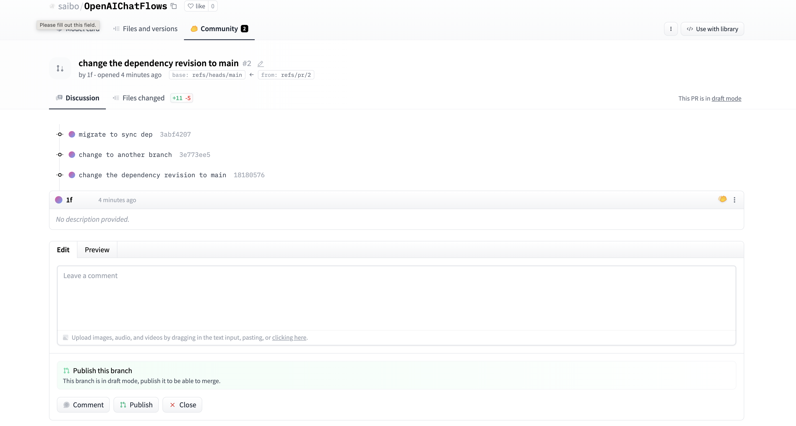

.. _contribute_module:

================================
Contribute to an Existing Module
================================

In this tutorial, we continue to use the ``trivial_sync_demo.py`` script. As the dependencies are synced to your root directory, you can instantly modify the synced flow module according to your needs. Once you've made enough changes and feel ready to make a Pull Request (PR), you simply need to push your changes to the Hugging Face repository and create the PR.

For instance, let's say we want to update the dependency of `saibo/OpenAIChatFlows <https://huggingface.co/saibo/OpenAIChatFlows>`__ to the latest version of `martinjosifoski/OpenAIChatAtomicFlow <https://huggingface.co/martinjosifoski/OpenAIChatAtomicFlow/tree/main>`:

.. code-block:: python

    dependencies = [
        {"url": "martinjosifoski/OpenAIChatAtomicFlow", "revision": "main"} # cae3fdf2f0ef7f28127cf4bc35ce985c5fc4d19a -> main
    ]
    from flows import flow_verse
    flow_verse.sync_dependencies(dependencies) 

    from flow_modules.martinjosifoski.OpenAIChatAtomicFlow import OpenAIChatAtomicFlow

    class OpenAIChatGPT4(OpenAIChatAtomicFlow):
        def __init__(self, **kwargs):

Firstly, navigate to the synced folder, initialize a git repository, and commit your changes:

.. code-block:: shell

    (flows) ➜  dev-tutorial cd flow_modules/saibo/OpenAIChatFlows   
    (flows) ➜  OpenAIChatFlows git init               
    Initialized empty Git repository in /Users/yeeef/Desktop/dlab-ra/dev-tutorial/flow_modules/saibo/OpenAIChatFlows/.git/
    (flows) ➜  OpenAIChatFlows git:(main) ✗ git add .
    (flows) ➜  OpenAIChatFlows git:(main) ✗ git commit -m "Change the dependency revision to main"
    [main d7465df] Change the dependency revision to main
    1 file changed, 1 insertion(+), 1 deletion(-)

Next, you need to open a PR on the target Hugging Face repository. Navigate to ``Community`` and click on ``New pull request``.

.. image:: ../images/contribute_flow_1.png

Enter a brief description for your PR branch and click on ``Create PR branch``.

.. image:: ../images/contribute_flow_2.png

Once your PR branch has been created (for instance, ``pr/2``), you'll need to push your changes to this branch:

.. code-block:: shell

    (flows) ➜  OpenAIChatFlows git:(main) git checkout -b pr/2                                  
    Switched to a new branch 'pr/2'
    (flows) ➜  OpenAIChatFlows git:(pr/2) git remote add origin https://huggingface.co/saibo/OpenAIChatFlows
    (flows) ➜  OpenAIChatFlows git:(pr/2) git pull -r origin pr/2
    (flows) ➜  OpenAIChatFlows git:(pr/2) git push origin pr/2:pr/2
    Enumerating objects: 11, done.
    Counting objects: 100% (11/11), done.
    Delta compression using up to 10 threads
    Compressing objects: 100% (8/8), done.
    Writing objects: 100% (8/8), 952 bytes | 952.00 KiB/s, done.
    Total 8 (delta 5), reused 0 (delta 0), pack-reused

    0
    To https://huggingface.co/saibo/OpenAIChatFlows
    1849a87..1818057  pr/2 -> refs/pr/2

Finally, review your PR changes on the Hugging Face PR page and click the ``Publish`` button to finalize your submission.

Develop over an existing module and publish it under your namespace
===================================================================

As a Flow developer, you can easily develop based on any synced flow modules. However, instead of making a PR to the original repository, you may wish to publish it under your own namespace. This can be the case if you've made substantial changes that the original author might not prefer. 

Let's get back to our ``trivial_sync_demo``, where we leverage ``saibo/OpenAIChatFlows``. We have made some changes to it and want to publish it on our own as ``yeeef/MyOpenAIChatFlows``. To do this, we recommend following steps:

**Step 1**: Manually copy the modified flow module out of the ``flow_modules`` directory:

.. code-block:: shell

    (flows) ➜  dev-tutorial cp -r ./flow_modules/saibo/OpenAIChatFlows PATH_TO_LOCAL_DEV_DIRECTORY/MyOpenAIChatFlows

**Step 2**: Next, we can treat it as a local file directory and sync it with a local revision:

.. code-block:: python

    dependencies = [
        {"url": "saibo/OpenAIChatFlows", "revision": "main"},
        {"url": "yeeef/MyOpenAIChatFlows", "revision": "PATH_TO_LOCAL_DEV_DIRECTORY/MyOpenAIChatFlows"},

    ]
    from flows import flow_verse
    flow_verse.sync_dependencies(dependencies) 

    from flow_modules.saibo.OpenAIChatFlows import OpenAIChatGPT4
    from flow_modules.yeeef.MyOpenAIChatFlows import MyOpenAIChatGPT4

    if __name__ == "__main__":
        print("it is a trivial sync demo")

**Step 3**: Finally, follow the procedure outlined in :ref:`publishing_module` section, and you are good to go!
