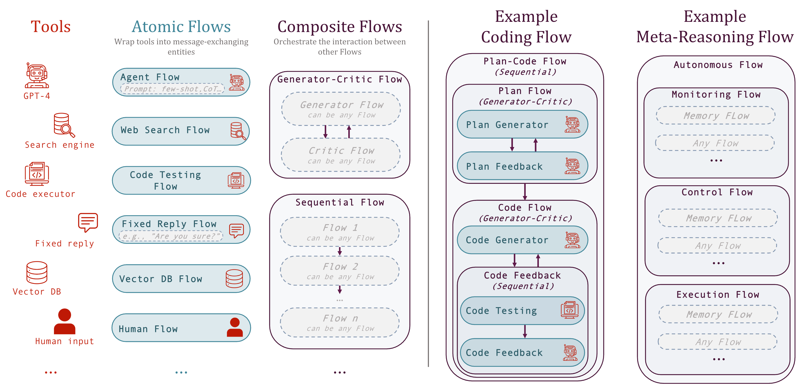

Introduction
=============

.. toctree::
   :maxdepth: 4
   :caption: Table of Contents
   :hidden:

   introduction/index
   installation/index
   getting_started/index
   contributing_info/contribute_index
   citation/index
   source/modules

.. figure:: media/logo_text_statement_alt_rounded_corners.png
   :align: center
   :alt: image
   :width: 600px

🤖🌊 **aiFlows** embodies the `Flows`_ (`arXiv`_) abstraction and greatly simplifies the design and
implementation of complex (work)Flows involving humans, AI systems, and tools. It enables:

- 🧩 Modularity: Flows can be stacked like LEGO blocks into arbitrarily nested structures with the complexity hidden behind a message-based interface
- 🤝 Reusability: Flows can be shared publicly on the FlowVerse, readily downloaded and reused as part of different Flows
- 🔀 Concurrency: Being consistent with the Actor model of concurrent computation, Flows are concurrency friendly – a necessary feature for a multi-agent future

.. _Flows: https://github.com/epfl-dlab/aiflows/assets/flows_paper.pdf
.. _arXiv: https://arxiv.org/abs/2308.01285

Flows in a Nutshell
---------------------

The framework is centered around *Flows* and *messages*.
Flows represent the fundamental building block of computation. They are independent, self-contained, goal-driven entities able to complete a semantically meaningful unit of work.
To exchange information, Flows communicate via a standardized message-based interface. Messages can be of any type the recipient Flow can process.

   The *Flows* framework exemplified. **The first column depicts examples of tools.** Notably, in the Flows framework, AI systems correspond to tools. The second column depicts Atomic Flows, effectively minimal wrappers around tools constructed from the example tools. The third column depicts examples of Composite Flows defining structured interaction between *Atomic* or *Composite* Flows. The fourth column illustrates a specific *Composite* competitive coding Flow as those used in the experiments in the paper. The fifth column outlines the structure of a hypothetical Flow, defining a meta-reasoning process that could support autonomous behavior.

FlowVerse in a Nutshell
----------------------------

The FlowVerse is a repository of Flows (powered by the 🤗 HuggingFace hub) created and shared by our community for everyone to use! With aiFlows, Flows can be readily downloaded, used, extended, or composed into novel, more complex For instance, sharing a Flow that uses only API-based tools (tools subsume models in the Flows abstraction) is as simple as sharing a config file. As an example, `here <https://huggingface.co/aiflows/AutoGPTFlowModule>`_ is the AutoGPT Flow on FlowVerse. For the ones using ChatGPT, you could think of them as completely customizable open-source GPTs(++).

The FlowVerse is continuously growing. To explore the currently available Flows, check out the FlowVerse Forum on the Discord `channel <https://discord.gg/yFZkpD2HAh>`_. Additionally, the *Tutorials* and *Detailed Examples* in the `Getting Started <https://epfl-dlab.github.io/flows/docs/built_with_sphinx/html/getting_started/index.html>`_ sections cover some of the Flows we provide in more detail (e.g., the ChatAtomicFlow and QA, VisionAtomicFlow and VisualQA, ReAct and ReAct with human feedback, AutoGPT, etc.).

Why should I use aiFlows?
----------------------------

AI is set to revolutionize the way we work. Our mission is to support AI researchers and to allow them to seamlessly share advancements with practitioners. This will establish a feedback loop, guiding progress toward beneficial directions while ensuring that everyone can freely access and benefit from the next-generation AI tools.

As a researcher, you will benefit from:
~~~~~~~~~~~~~~~~~~~~~~~~~~~~~~~~~~~~~~~~~~~~~

- The ability to design, implement, and study arbitrarily complex interactions
- Complete control and customizability (e.g., the tools, the specific Flows and the information they have access to, the choice of models and their deployment, etc.).
- The ability to readily reproduce, reuse, or build on top of Flows shared on the FlowVerse and systematically study them across different settings (the infrastructure in the `cc_flows` repository could be a useful starting point in future studies).
- The ability to readily make your work accessible to practitioners and other researchers and access their feedback.

As a practitioner, you will benefit from:
~~~~~~~~~~~~~~~~~~~~~~~~~~~~~~~~~~~~~~~~~~~~~

- The ability to design and implement arbitrarily complex interactions.
- Complete control and customizability (e.g., the tools, the specific Flows and the information they have access to, the choice of models and their deployment, etc.).
- The ability to readily reuse or build on top of Flows shared on the FlowVerse.
- Direct access to any advancements in the field.

To develop the next-generation AI tools and simultaneously maximize the benefits, developers and researchers need to have complete control over their workflows. aiFlows strives to empower you to make each Flow your own! See the `contribute <../contributing_info/index.rst>`_ section for more information.
